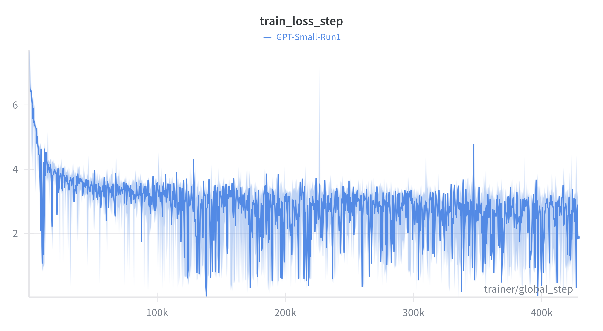

# Wiki-To-Go: A Pocket-Sized GPT

Large Language Models often feel like magic—black boxes that live in the cloud and know everything. But what happens when you decide to build one yourself? 

**Wiki-To-Go** is an educational journey to demystify that magic. We didn't just fine-tune an existing model; we started from the raw atoms of knowledge: the compressed Wikipedia XML dumps. We built the parser, trained the tokenizer, and successfully trained a GPT-Small model on the sum of human knowledge (well, the English parts of it).

This project proves that with a bit of patience (and a good GPU), you get a model that at least kind of understands english grammar.

---

## Repository Structure

Here is how the project is organized:

```text
/workspace
├── Data/
│   ├── enwiki-latest-pages-articles-multistream.xml.bz2  # The massive source
│   └── wiki_data_cleaned.txt                             # The 27GB clean text file
│
└── Wiki-To-Go/
    ├── Models/
    │   ├── Checkpoints/       # Saved training checkpoints
    │   └── Tokenizer/         # The trained BPE tokenizer.json
    │
    ├── Parse_raw_Wiki/        # 1. THE CLEANER
    │   ├── build_wiki_dataset.py
    │   └── README.md          # <-- Details on parsing logic here
    │
    ├── Tokenizer/             # 2. THE TRANSLATOR
    │   ├── Educational_BPE_Tokenizer.py  # A "from scratch" python implementation
    │   ├── Production_Tokenizer.py       # The fast Rust-backend implementation
    │   └── README.md          # <-- Deep dive into BPE theory here
    │
    ├── Training/              # 3. THE BRAIN
    │   ├── train_gpt.py       # The PyTorch Lightning training loop
    │   └── Train_loss.png
    │
    └── Prompting/             # 4. THE INTERFACE
        └── interactive.py     # <-- Terminal chat with the model
```

---

## 🛠️ The Pipeline

### 1. Parsing the World
Before a model can learn, it must read. We processed the 25GB compressed Wikipedia dump, stripping away HTML, tables, and markup to produce clean, linear text.
*   **Detailed Documentation:** [Read about the Parser logic](./Wiki-To-Go/Parse_raw_Wiki/README.md)

### 2. Tokenization (BPE)
A neural network doesn't understand "Apple"; it understands numbers. We implemented Byte Pair Encoding (BPE) to create a vocabulary of 32,000 subword tokens, balancing efficiency and generalization.
*   **Detailed Documentation:** [Read about the Tokenizer & Theory](./Wiki-To-Go/Tokenizer/README.md)

---

## 📉 Training Results

We trained a **GPT-Small** architecture (12 layers, 12 heads, 768 embedding dim) from scratch.

### The Learning Curve
The model converged, learning the structure of language and grammar. Some might say it learned facts, but I think it needs more neurons for that.


### The "num_workers" Lesson Learned
Training took approximately **100 hours** on an RTX 3090. 

You might notice or might not that this is twice the time it should take. The reason is that I set `num_workers=2` in the dataloader, assuming that they would share the work. This is not how it works with unindexed datasets. There, they just do things twice, adding 2 additional days of training time. 


## What did it learn?

Since the model was trained *exclusively* on Wikipedia, it doesn't talk like a chatbot. It rather talks like a **confused Wikipedia Editor**.

Here are some **actual** outputs from the model:

**1. Its trying its best okayyy!!**
> **You:** The one thing I am sure of is\
> **GPT:** ...that I have been trying to be a good editor, so I'm not sure how to do that. I am a bit confused. I have never edited for pay, but I know that I have a conflict of interest.

**2. Professor, there is one thing that I dont get ..**
> **You:** Currently I am paid with\
> **GPT:** ...the article for the article. I am also a professor of the English Department at the University of California, Santa Barbara. I am a member of the American Association of University Professors.

**3. Is that how you spell Paris?**
> **You:** The capitol of France is\
> **GPT:** ...a military residence located in the commune of Ferrand, in the French department of Loire-Inférieure. It is the only remaining former military facility in France, being set up in 1990.

**4. If you need a tax advisor, just call me**
> **You:** Tax evasion is \
> **GPT:** ...likely to be a form of coordinated Sockpuppet. The evidence is likely to be related to the use of multiple accounts to circumvent the block, given the nature of a behavioral investigation, and the amount of activity in the TAs.

---

## How to Run
1.  **Clone the repo**
    ```bash
    git clone https://github.com/Max-Tost/Wiki-To-Go
    ```

2.  **Download the raw Wiki files from [here](https://dumps.wikimedia.org/enwiki/20250901/enwiki-20250901-pages-articles-multistream.xml.bz2).** 

3.  **Parse them:**
    ```bash
    python /Parse_raw_Wiki/build_wiki_dataset.py
    ```

4.  **Train the Tokenizer:**
    ```bash
    python /Tokenizer/Production_Tokenizer.py
    ```

5.  **Train the Model:**
    ```bash
    python Training/train_gpt.py

6.  **Chat with the Model:**
    ```bash
    python Prompting/interactive.py
    ```